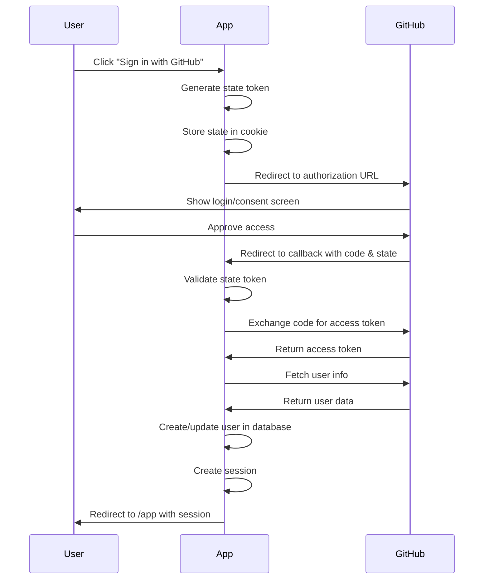

# GitHub OAuth 2.0 Authentication

This module provides a minimal implementation of GitHub OAuth 2.0 for user authentication using the **Arctic** library.

## 🚀 Quick Start

### 1. Create a GitHub OAuth App

1. Go to **GitHub Settings** → **Developer settings** → **OAuth Apps**
2. Click **New OAuth App**
3. Fill in the application details:
   - **Application name**: Smart Dash (or your app name)
   - **Homepage URL**: `http://localhost:3715` (or your production URL)
   - **Authorization callback URL**: `http://localhost:3715/auth/github/callback`
4. Click **Register application**
5. Copy your **Client ID**
6. Click **Generate a new client secret** and copy it

### 2. Configure Environment Variables

Create or update your `.env` file:

```env
GITHUB_CLIENT_ID=your_client_id_here
GITHUB_CLIENT_SECRET=your_client_secret_here
```

### 3. Use in Your Application

**Trigger login from any component:**

```svelte
<a href="/auth/github">
  <button>Sign in with GitHub</button>
</a>
```

Or programmatically:

```svelte
<script>
  function handleLogin() {
    window.location.href = '/auth/github';
  }
</script>

<button onclick={handleLogin}>
  Sign in with GitHub
</button>
```

## 📁 File Structure

```
src/lib/services/github/
├── github.ts                 # GitHub OAuth client initialization
├── getAuthorizationUrl.ts    # Generate OAuth URL
├── getUserInfo.ts            # Fetch user data from GitHub
└── README.md                 # This file

src/routes/auth/github/
├── +server.ts                # Login route (initiates OAuth)
└── callback/
    ├── +page.server.ts       # Callback handler (exchanges code for token)
    └── +page.svelte          # Callback page (redirects to app)
```

## 🔄 Authentication Flow



## 🔐 Security Features

- **CSRF Protection**: State parameter validated on callback
- **HttpOnly Cookies**: State stored in secure cookies
- **Secure Flag**: Enabled in production
- **Short Expiration**: 10-minute window for OAuth flow
- **Private Email Handling**: Fetches from `/user/emails` endpoint if needed

## 📝 API Reference

### `github`

The Arctic GitHub OAuth client instance.

```typescript
import { github } from '$lib/services/github/github';
```

### `getAuthorizationUrl(state: string): URL`

Generates the GitHub authorization URL.

**Parameters:**
- `state` (string): CSRF protection token

**Returns:** URL object to redirect user to GitHub

**Example:**
```typescript
import { getAuthorizationUrl } from '$lib/services/github/getAuthorizationUrl';

const state = generateState();
const url = getAuthorizationUrl(state);
// Redirect user to: url.toString()
```

### `getUserInfo(code: string): Promise<GitHubUser>`

Exchanges authorization code for access token and fetches user information.

**Parameters:**
- `code` (string): Authorization code from GitHub callback

**Returns:** Promise resolving to `GitHubUser` object

**GitHubUser Type:**
```typescript
type GitHubUser = {
  email: string;    // User's email (handles private emails)
  name: string;     // User's display name or username
  picture: string;  // User's avatar URL
};
```

**Example:**
```typescript
import { getUserInfo } from '$lib/services/github/getUserInfo';

const user = await getUserInfo(code);
console.log(user.email); // "user@example.com"
console.log(user.name);  // "John Doe" or "johndoe"
console.log(user.picture); // "https://avatars.githubusercontent.com/..."
```

## 🎯 Complete Implementation Example

### Backend (Callback Handler)

```typescript
// src/routes/auth/github/callback/+page.server.ts
import { redirect } from '@sveltejs/kit';
import type { PageServerLoad } from './$types';
import { getUserInfo } from '$lib/services/github/getUserInfo';

export const load: PageServerLoad = async ({ url, cookies }) => {
  const code = url.searchParams.get('code');
  const state = url.searchParams.get('state');
  const storedState = cookies.get('github_oauth_state');

  // Validate state
  if (!code || !state || !storedState || state !== storedState) {
    redirect(302, '/auth/error');
  }

  // Clear state cookie
  cookies.delete('github_oauth_state', { path: '/' });

  try {
    // Get user info from GitHub
    const githubUser = await getUserInfo(code);

    // TODO: Store user in your database
    // TODO: Create user session
    // TODO: Set session cookie

    return { user: githubUser };
  } catch (error) {
    console.error('GitHub OAuth error:', error);
    redirect(302, '/auth/error');
  }
};
```

### Frontend (Login Button)

```svelte
<!-- src/routes/login/+page.svelte -->
<script>
  import { Button } from '$lib/components/ui/button';
  import { GitHub } from '$lib/components/icons';

  function handleGitHubLogin() {
    window.location.href = '/auth/github';
  }
</script>

<Button onclick={handleGitHubLogin}>
  <GitHub class="mr-2 h-4 w-4" />
  Sign in with GitHub
</Button>
```

## 🔧 Customization

### Request Additional Scopes

Edit `getAuthorizationUrl.ts` to request more permissions:

```typescript
export function getAuthorizationUrl(state: string): URL {
  const scopes = [
    'user:email',
    'read:user',
    'repo', // Add repository access
    'gist', // Add gist access
  ];
  return github.createAuthorizationURL(state, scopes);
}
```

### Fetch Additional User Data

Edit `getUserInfo.ts` to fetch more information:

```typescript
export async function getUserInfo(code: string): Promise<GitHubUser> {
  const tokens = await github.validateAuthorizationCode(code);

  // Fetch user profile
  const response = await fetch('https://api.github.com/user', {
    headers: {
      Authorization: `Bearer ${tokens.accessToken()}`,
      Accept: 'application/vnd.github.v3+json',
    },
  });

  const data = await response.json();

  // Fetch additional data (e.g., repositories)
  const reposResponse = await fetch('https://api.github.com/user/repos', {
    headers: {
      Authorization: `Bearer ${tokens.accessToken()}`,
      Accept: 'application/vnd.github.v3+json',
    },
  });

  const repos = await reposResponse.json();

  return {
    email: data.email,
    name: data.name || data.login,
    picture: data.avatar_url,
    bio: data.bio,
    location: data.location,
    repositories: repos,
  };
}
```

## 🐛 Troubleshooting

### Error: "Missing required GitHub OAuth environment variables"

**Solution:** Ensure `GITHUB_CLIENT_ID` and `GITHUB_CLIENT_SECRET` are set in your `.env` file.

### Error: "Failed to fetch user info from GitHub"

**Possible causes:**
1. Invalid authorization code
2. GitHub API rate limit exceeded
3. Network issues

**Solution:** Check console logs for detailed error messages.

### User email is null

**Cause:** User has set their email as private on GitHub.

**Solution:** The implementation automatically handles this by fetching from the `/user/emails` endpoint with the `user:email` scope.

### Redirect URI mismatch

**Cause:** The callback URL in your GitHub OAuth App settings doesn't match the actual callback URL.

**Solution:** Ensure your GitHub OAuth App callback URL exactly matches:
- Development: `http://localhost:3715/auth/github/callback`
- Production: `https://yourdomain.com/auth/github/callback`

## 📚 Resources

- [GitHub OAuth Documentation](https://docs.github.com/en/apps/oauth-apps/building-oauth-apps/authorizing-oauth-apps)
- [Arctic Library Documentation](https://arctic.js.org/)
- [GitHub REST API - Users](https://docs.github.com/en/rest/users/users)
- [GitHub OAuth Scopes](https://docs.github.com/en/apps/oauth-apps/building-oauth-apps/scopes-for-oauth-apps)

## 🔒 Production Checklist

- [ ] Use HTTPS for callback URL
- [ ] Store client secret securely (never commit to version control)
- [ ] Enable `secure` flag on cookies in production
- [ ] Implement proper session management
- [ ] Add database user storage
- [ ] Implement rate limiting
- [ ] Add error logging and monitoring
- [ ] Handle OAuth errors gracefully with user-friendly messages
- [ ] Test with GitHub accounts that have private emails
- [ ] Update GitHub OAuth App settings with production callback URL